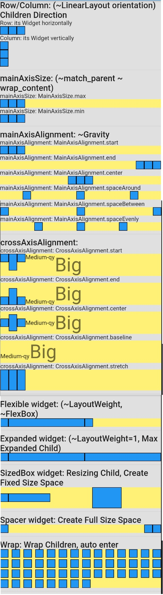
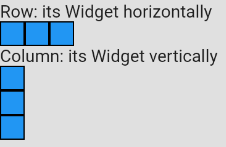
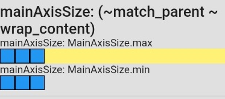
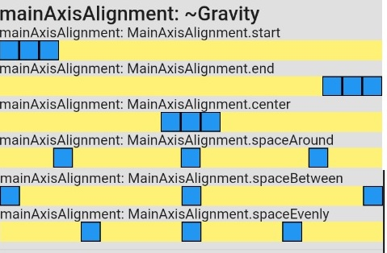
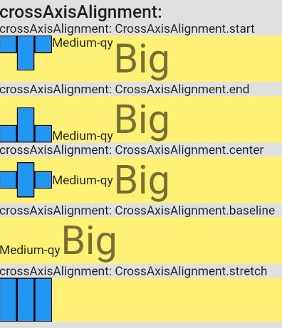
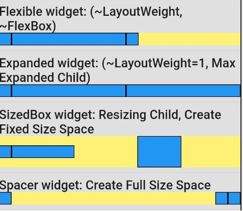
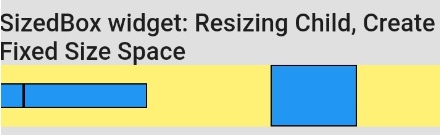
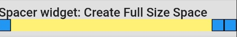
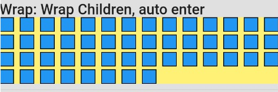

# Layout Basic - Layout Cơ bản



- [Layout Basic - Layout Cơ bản](#layout-basic---layout-cơ-bản)
  - [Row/Column: (giống LinearLayout orientation) Hướng của các con](#rowcolumn-giống-linearlayout-orientation-hướng-của-các-con)
  - [mainAxisSize (Kích thước trục chính): (giống match_parent/ wrap_content) Kích thước bao bọc](#mainaxissize-kích-thước-trục-chính-giống-match_parent-wrap_content-kích-thước-bao-bọc)
  - [mainAxisAlignment (căn chỉnh trục chính): giống Gravity](#mainaxisalignment-căn-chỉnh-trục-chính-giống-gravity)
  - [crossAxisAlignment (căn chỉnh trục chéo)](#crossaxisalignment-căn-chỉnh-trục-chéo)
  - [Flexible widget (linh hoạt): (giống LayoutWeight, FlexBox) flex box](#flexible-widget-linh-hoạt-giống-layoutweight-flexbox-flex-box)
  - [Expanded widget (mở rộng): (giống LayoutWeight=1) Tự mở rộng tối đa](#expanded-widget-mở-rộng-giống-layoutweight1-tự-mở-rộng-tối-đa)
  - [SizedBox widget: Đổi kích thước, Tạo Space có kích cỡ](#sizedbox-widget-đổi-kích-thước-tạo-space-có-kích-cỡ)
  - [Spacer widget: Tạo Space full size](#spacer-widget-tạo-space-full-size)
  - [Wrap: Wrap Children, Tự động xuống hàng](#wrap-wrap-children-tự-động-xuống-hàng)
  - [Stack - Widget chồng nhau](#stack---widget-chồng-nhau)
    - [Fit: kích thước children](#fit-kích-thước-children)
    - [alignment: Canh chỉnh children](#alignment-canh-chỉnh-children)
    - [Positioned: Vị trí tuyệt đối của childen](#positioned-vị-trí-tuyệt-đối-của-childen)
    - [Overflow: cho phép child tràn ra ngoài](#overflow-cho-phép-child-tràn-ra-ngoài)

## Row/Column: (giống LinearLayout orientation) Hướng của các con



- Row: Hướng con theo Ngang
- Column: Hướng con theo Dọc

```dart
return Row(
  children: <Widget>[
    BlueBox(),
    BlueBox(),
    BlueBox(),
  ],
);
```

## mainAxisSize (Kích thước trục chính): (giống match_parent/ wrap_content) Kích thước bao bọc



- mainAxisSize: 
  - MainAxisSize.max
  - MainAxisSize.min

```dart
Row(
  mainAxisSize: MainAxisSize.max,
  children: <Widget>[
    BlueBox(),
    BlueBox(),
    BlueBox(),
  ],
),
```

## mainAxisAlignment (căn chỉnh trục chính): giống Gravity



1. mainAxisAlignment:
   1. MainAxisAlignment.start
   2. MainAxisAlignment.end
   3. MainAxisAlignment.center
   4. MainAxisAlignment.spaceAround
   5. MainAxisAlignment.spaceBetween
   6. MainAxisAlignment.spaceEvenly

```dart
Row(
  mainAxisSize: MainAxisSize.max,
  mainAxisAlignment: MainAxisAlignment.start,
  children: <Widget>[
    BlueBox(),
    BlueBox(),
    BlueBox(),
  ],
),
```

## crossAxisAlignment (căn chỉnh trục chéo)



1. crossAxisAlignment:
   1. CrossAxisAlignment.start
   2. CrossAxisAlignment.end
   3. CrossAxisAlignment.center
   4. CrossAxisAlignment.baseline
   5. CrossAxisAlignment.stretch

```dart
Row(
  crossAxisAlignment: CrossAxisAlignment.start,
  children: [
    BlueBox(),
    BiggerBlueBox(),
    BlueBox(),
    MediumText(),
    BigText(),
  ],
),

// baseline
crossAxisAlignment: CrossAxisAlignment.baseline,
textBaseline: TextBaseline.alphabetic,

// stretch
crossAxisAlignment: CrossAxisAlignment.stretch,
children: [ //No text ]
```

## Flexible widget (linh hoạt): (giống LayoutWeight, FlexBox) flex box



```dart
Row(
  children: [
    BlueBox(),
    // 1 Flexible = Tổng Flex chia ra = remainingSpace * (flex / totalOfAllFlexValues)
    Flexible(
      // tight: dài hết 1/2
      fit: FlexFit.tight,
      flex: 1,
      child: BlueBox(),
    ),
    Flexible(
      // loose: về kích thước thật
      fit: FlexFit.loose,
      flex: 1,
      child: BlueBox(),
    ),
  ],
),
```

## Expanded widget (mở rộng): (giống LayoutWeight=1) Tự mở rộng tối đa


```dart
Row(
  children: <Widget>[
    BlueBox(),
    Expanded(child: BlueBox(),),
    Expanded(child: BlueBox(),),
  ],
),
```

## SizedBox widget: Đổi kích thước, Tạo Space có kích cỡ



```dart
Row(
  children: <Widget>[
    BlueBox(),
    SizedBox(width: 100, child: BlueBox(),),
    // Create Space
    SizedBox(width: 100,),
    SizedBox(height: 50, width: 70, child: BlueBox(),),
  ],
),
```

## Spacer widget: Tạo Space full size



```dart
Row(
  children: <Widget>[
    BlueBox(),
    // Create Space
    Spacer(flex: 1,),
    BlueBox(),
    BlueBox(),
  ],
),
```

## Wrap: Wrap Children, Tự động xuống hàng



```dart
_buildWrap() {
  // make 50 boxs
  List<Widget> list = new List();
  for (int i=0; i<50; i++) {
    list.add(BlueBox());
  }

  return ColorfulContainer(
    child: Wrap(
      spacing: 8.0, // gap between adjacent chips
      runSpacing: 4.0, // gap between lines
      children: list,
    ),
  );
}
```

## Stack - Widget chồng nhau


```dart
Stack(
  fit: StackFit.expand,
  alignment: AlignmentDirectional.bottomCenter,
  overflow: Overflow.clip,
  children: <Widget>[
    GreenBox(),
    RedBox(),
    BlueBox(),
  ],
);
```

### Fit: kích thước children

- StackFit.loose: bình thường
- StackFit.expand: Full size

### alignment: Canh chỉnh children

### Positioned: Vị trí tuyệt đối của childen

```dart
Stack(
  children: <Widget>[
    Positioned(child: BlueBox(),
      top: -20,
      right: 100,
    ),
  ],
  overflow: overflow,
),
```

### Overflow: cho phép child tràn ra ngoài

- Overflow.clip: Không hiển thị view tràn
- Overflow.visible: hiển thị view tràn

---
