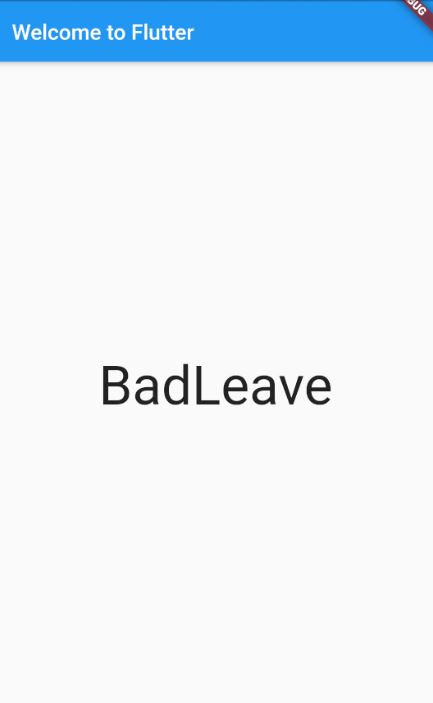

# TextView Basic

- [TextView Basic](#textview-basic)
  - [TextWidget: hiện trong Stageless widget](#textwidget-hiện-trong-stageless-widget)
  - [TextWidget: hiện trong Stateful widget](#textwidget-hiện-trong-stateful-widget)



## TextWidget: hiện trong Stageless widget

```dart
void main() => runApp(MyApp());

// StatelessWidget: Widget (UI) bất biến, Widget không thay đổi theo Objects
class MyApp extends StatelessWidget {

  @override
  Widget build(BuildContext context) {

    return Text(
      "Hello word!",
      style: TextStyle(fontSize: 50),
    );
  }
}
```

## TextWidget: hiện trong Stateful widget

```dart
// StatefulWidget: Widget (UI) thay đổi theo Objects bên trong
class RandomWords extends StatefulWidget {
  @override
  State<StatefulWidget> createState() => RandomWordState();
}

class RandomWordState extends State<RandomWords> {

  @override
  Widget build(BuildContext context) {
    return Text(
      "Hello word!",
      style: TextStyle(fontSize: 50),
    );
  }
}
```
