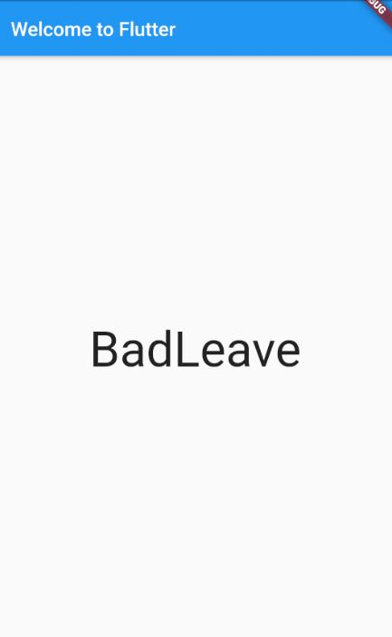

# TextView Basic

<https://flutter.dev/docs/get-started/codelab>



## App Dependencies (library)

- Thêm trong file: **pubspec.yaml**

```yaml
dependencies:
  // ...
  // Thêm tại đây
  english_words: ^3.1.0
```

- **$ Packages get**: cài đặt Dependency mới
- **$ Packages upgrade**: update Dependency mới

## Start

```dart
import 'package:flutter/material.dart';
import 'package:english_words/english_words.dart';

void main() => runApp(MyApp());

// StatelessWidget: Widget (UI) bất biến, Widget không thay đổi theo Objects
class MyApp extends StatelessWidget {

  @override
  Widget build(BuildContext context) {

    return MaterialApp(
      title: 'Flutter Demo',
      theme: ThemeData(
        primarySwatch: Colors.blue,
      ),
      home: Scaffold(
          appBar: AppBar(
            title: Text('Welcome to Flutter'),
          ),
          body: Center(
              child: RandomWords()
          )
      ),
    );
  }
}
```

```dart
// StatefulWidget: Widget (UI) thay đổi theo Objects bên trong
class RandomWords extends StatefulWidget {
  @override
  State<StatefulWidget> createState() => RandomWordState();
}

class RandomWordState extends State<RandomWords> {
  final wordPair = WordPair.random(); // Create Random word

  @override
  Widget build(BuildContext context) {
    // "Text" thay đổi theo "wordPair"
    return Text(
      wordPair.asPascalCase,
      style: TextStyle(fontSize: 50),
    );
  }
}
```

---
