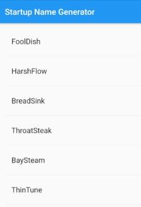

# ListView Basic

<https://flutter.dev/docs/get-started/codelab>



## App Dependencies (library)

- Thêm trong file: **pubspec.yaml**

```yaml
dependencies:
  // ...
  // Thêm tại đây
  english_words: ^3.1.0
```

- **$ Packages get**: cài đặt Dependency mới
- **$ Packages upgrade**: update Dependency mới

## Start

```dart
import 'package:flutter/material.dart';
import 'package:english_words/english_words.dart';

void main() => runApp(MyApp());

// StatelessWidget: Widget (UI) bất biến, Widget không thay đổi theo Objects
class MyApp extends StatelessWidget {

  @override
  Widget build(BuildContext context) {

    return MaterialApp(
      title: 'Flutter List Demo',
      home: RandomWords()
    );
  }
}
```

```dart
// StatefulWidget: Widget (UI) thay đổi theo Objects bên trong
class RandomWords extends StatefulWidget {
  @override
  State<StatefulWidget> createState() => RandomWordState();
}
```

```dart
class RandomWordState extends State<RandomWords> {

  final _suggestions = <WordPair>[];
  final _biggerFont = const TextStyle(fontSize: 18.0);

// Step 2
  Widget _buildSuggestions() {
    return ListView.builder(
        padding: const EdgeInsets.all(16.0),
        itemBuilder: (context, i) {
          // Dòng lẻ => là Divider
          if (i.isOdd) return Divider();

          // index dòng chẵn = index của _suggestions
          final index = i ~/ 2;
          if (index >= _suggestions.length) {
              // Thêm 10 dòng vào list
            _suggestions.addAll(generateWordPairs().take(10));
          }
          return _buildRow(index, _suggestions[index]);
        }
    );
  }

// Step 3
  Widget _buildRow(int index, WordPair pair) {
    return ListTile(
      title: Text(
        index.toString() + pair.asPascalCase,
        style: _biggerFont,
      ),
    );
  }

// Step 1
  @override
  Widget build(BuildContext context) {

    return Scaffold(
      appBar: AppBar(
        title: Text('Startup Name Generator'),
      ),
      body: _buildSuggestions(),
    );
  }
}
```

---
