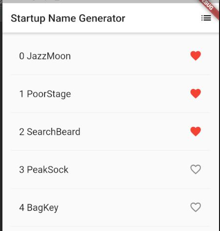
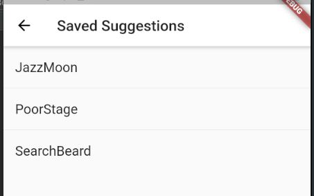

# ListView Basic

<https://codelabs.developers.google.com/codelabs/first-flutter-app-pt2>




## App Dependencies (library)

- Thêm trong file: **pubspec.yaml**

```yaml
dependencies:
  // ...
  // Thêm tại đây
  english_words: ^3.1.0
```

- **$ Packages get**: cài đặt Dependency mới
- **$ Packages upgrade**: update Dependency mới

## Start

```dart
import 'package:flutter/material.dart';
import 'package:english_words/english_words.dart';

void main() => runApp(MyApp());

// StatelessWidget: Widget (UI) bất biến, Widget không thay đổi theo Objects
class MyApp extends StatelessWidget {

  @override
  Widget build(BuildContext context) {

    return MaterialApp(
        title: 'Flutter List Demo',
        theme: ThemeData(
          // White Status bar
          primaryColor: Colors.white
        ),
        home: RandomWords()
    );
  }
}
```

```dart
// StatefulWidget: Widget (UI) thay đổi theo Objects bên trong
class RandomWords extends StatefulWidget {
  @override
  State<StatefulWidget> createState() => RandomWordState();
}
```

```dart
class RandomWordState extends State<RandomWords> {

  final _suggestions = <WordPair>[];
  final _saved = Set<WordPair>(); // Set: mỗi phần tử chỉ có 1
  final _biggerFont = const TextStyle(fontSize: 18.0);

// Tạo list View
  Widget _buildSuggestions() {
    return ListView.builder(
        padding: const EdgeInsets.all(16.0),
        itemBuilder: (context, i) {
          // Dòng lẻ => là Divider
          if (i.isOdd) return Divider();

          // index dòng chẵn = index của _suggestions
          final index = i ~/ 2;
          if (index >= _suggestions.length) {
            // Thêm 10 dòng vào list
            _suggestions.addAll(generateWordPairs().take(10));
          }

          return _buildRow(index, _suggestions[index]);
        }
    );
  }

// Tạo dòng
  Widget _buildRow(int index, WordPair pair) {
    final bool alreadySaved = _saved.contains(pair);

    return ListTile(
      title: Text(
        index.toString() + "\t" + pair.asPascalCase,
        style: _biggerFont,
      ),

      // Favorite Icon
      trailing: Icon(
        alreadySaved ? Icons.favorite : Icons.favorite_border,
        color: alreadySaved ? Colors.red : null,
      ),

      // Tap to change Favorite status
      onTap: () {
        // === Đánh dấu thay đổi _saved, nên thay đổi UI ===
        setState(() {
          if (alreadySaved) {
            _saved.remove(pair);
          } else {
            _saved.add(pair);
          }
        });
      },
    );
  }

  // Qua màn hình Saved
  void _pushSaved() {
    // Go to
    Navigator.of(context).push(
      MaterialPageRoute<void>(
          builder: (BuildContext context) {

            //region Tạo List View thứ 2

            // List Items
            final Iterable<ListTile> titles = _saved.map(
                    (WordPair pair) {
                      return ListTile(
                        title: Text(
                          pair.asPascalCase,
                          style: _biggerFont,
                        ),
                      );
              }
            );

            // Thêm Divider vào List
            final List<Widget> divided = ListTile
              .divideTiles(
                context: context,
                tiles: titles,
            ).toList();

            return Scaffold(
              appBar: AppBar(
                title: Text('Saved Suggestions'),
              ),
              body: ListView(children: divided,),
            );

            //endregion
          }
      )
    );
  }

// Step 1
  @override
  Widget build(BuildContext context) {

    return Scaffold(
      appBar: AppBar(
        title: Text('Startup Name Generator'),
        // List button
        actions: <Widget>[
          IconButton(icon: Icon(Icons.list), onPressed: _pushSaved)
        ],
      ),
      body: _buildSuggestions(),
    );
  }
}
```

---
