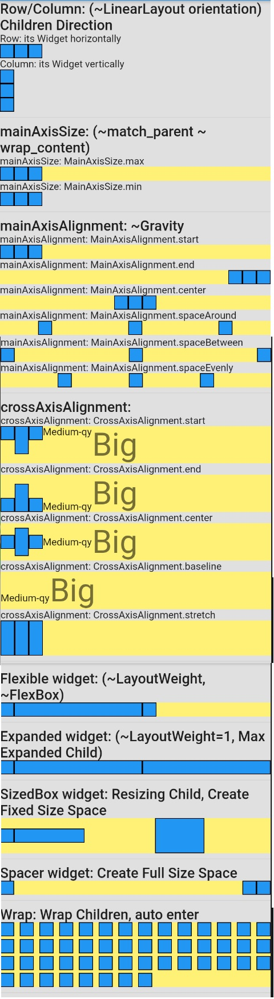
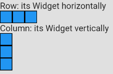
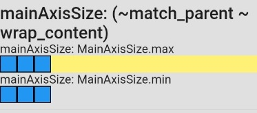
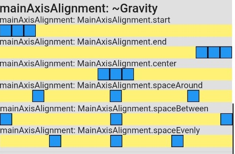
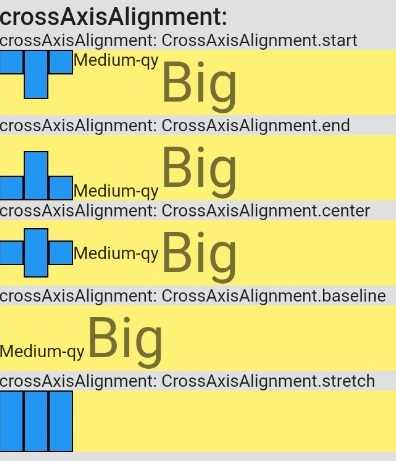
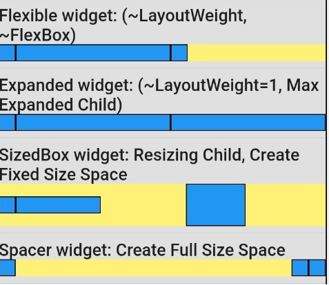
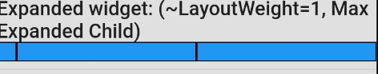
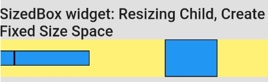
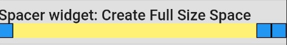
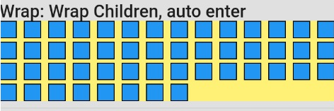

# Layout Basic - Layout Cơ bản



- [Layout Basic - Layout Cơ bản](#layout-basic---layout-c%c6%a1-b%e1%ba%a3n)
  - [Row/Column: (~LinearLayout orientation) Hướng của các con](#rowcolumn-linearlayout-orientation-h%c6%b0%e1%bb%9bng-c%e1%bb%a7a-c%c3%a1c-con)
  - [mainAxisSize (Kích thước trục chính): (~match_parent ~ wrap_content) Kích thước bao bọc](#mainaxissize-k%c3%adch-th%c6%b0%e1%bb%9bc-tr%e1%bb%a5c-ch%c3%adnh-matchparent--wrapcontent-k%c3%adch-th%c6%b0%e1%bb%9bc-bao-b%e1%bb%8dc)
  - [mainAxisAlignment (căn chỉnh trục chính): ~Gravity](#mainaxisalignment-c%c4%83n-ch%e1%bb%89nh-tr%e1%bb%a5c-ch%c3%adnh-gravity)
  - [crossAxisAlignment (căn chỉnh trục chéo)](#crossaxisalignment-c%c4%83n-ch%e1%bb%89nh-tr%e1%bb%a5c-ch%c3%a9o)
  - [Flexible widget (linh hoạt): (~LayoutWeight, ~FlexBox) flex box](#flexible-widget-linh-ho%e1%ba%a1t-layoutweight-flexbox-flex-box)
  - [Expanded widget (mở rộng): (~LayoutWeight=1) Tự mở rộng tối đa](#expanded-widget-m%e1%bb%9f-r%e1%bb%99ng-layoutweight1-t%e1%bb%b1-m%e1%bb%9f-r%e1%bb%99ng-t%e1%bb%91i-%c4%91a)
  - [SizedBox widget: Đổi kích thước, Tạo Space có kích cỡ](#sizedbox-widget-%c4%90%e1%bb%95i-k%c3%adch-th%c6%b0%e1%bb%9bc-t%e1%ba%a1o-space-c%c3%b3-k%c3%adch-c%e1%bb%a1)
  - [Spacer widget: Tạo Space full size](#spacer-widget-t%e1%ba%a1o-space-full-size)
  - [Wrap: Wrap Children, Tự động xuống hàng](#wrap-wrap-children-t%e1%bb%b1-%c4%91%e1%bb%99ng-xu%e1%bb%91ng-h%c3%a0ng)

## Row/Column: (~LinearLayout orientation) Hướng của các con



- Row: Hướng con theo Ngang
- Column: Hướng con theo Dọc

```dart
return Row(
  children: <Widget>[
    BlueBox(),
    BlueBox(),
    BlueBox(),
  ],
);
```

## mainAxisSize (Kích thước trục chính): (~match_parent ~ wrap_content)  Kích thước bao bọc



- mainAxisSize: MainAxisSize.max
- mainAxisSize: MainAxisSize.min

```dart
Row(
  mainAxisSize: mainAxisSize,
  children: <Widget>[
    BlueBox(),
    BlueBox(),
    BlueBox(),
  ],
),
```

## mainAxisAlignment (căn chỉnh trục chính): ~Gravity



1. mainAxisAlignment: MainAxisAlignment.start
2. mainAxisAlignment: MainAxisAlignment.end
3. mainAxisAlignment: MainAxisAlignment.center
4. mainAxisAlignment: MainAxisAlignment.spaceAround
5. mainAxisAlignment: MainAxisAlignment.spaceBetween
6. mainAxisAlignment: MainAxisAlignment.spaceEvenly

```dart
Row(
  mainAxisSize: MainAxisSize.max,
  mainAxisAlignment: mainAxisAlignment,
  children: <Widget>[
    BlueBox(),
    BlueBox(),
    BlueBox(),
  ],
),
```

## crossAxisAlignment (căn chỉnh trục chéo)



1. crossAxisAlignment: CrossAxisAlignment.start
2. crossAxisAlignment: CrossAxisAlignment.end
3. crossAxisAlignment: CrossAxisAlignment.center
4. crossAxisAlignment: CrossAxisAlignment.baseline
5. crossAxisAlignment: CrossAxisAlignment.stretch

```dart
Row(
  crossAxisAlignment: crossAxisAlignment,
  children: [
    BlueBox(),
    BiggerBlueBox(),
    BlueBox(),
    MediumText(),
    BigText(),
  ],
),

// baseline
crossAxisAlignment: CrossAxisAlignment.baseline,
textBaseline: TextBaseline.alphabetic,

// stretch
crossAxisAlignment: CrossAxisAlignment.stretch,
children: [ //No text ]
```

## Flexible widget (linh hoạt): (~LayoutWeight, ~FlexBox) flex box



```dart
Row(
  children: [
    BlueBox(),
    // 1 Flexible = Tổng Flex chia ra = remainingSpace * (flex / totalOfAllFlexValues)
    Flexible(
      // tight: dài hết 1/2
      fit: FlexFit.tight,
      flex: 1,
      child: BlueBox(),
    ),
    Flexible(
      // loose: về kích thước thật
      fit: FlexFit.loose,
      flex: 1,
      child: BlueBox(),
    ),
  ],
),
```

## Expanded widget (mở rộng): (~LayoutWeight=1) Tự mở rộng tối đa



```dart
Row(
  children: <Widget>[
    BlueBox(),
    Expanded(child: BlueBox(),),
    Expanded(child: BlueBox(),),
  ],
),
```

## SizedBox widget: Đổi kích thước, Tạo Space có kích cỡ



```dart
Row(
  children: <Widget>[
    BlueBox(),
    SizedBox(width: 100, child: BlueBox(),),
    // Create Space
    SizedBox(width: 100,),
    SizedBox(height: 50, width: 70, child: BlueBox(),),
  ],
),
```

## Spacer widget: Tạo Space full size



```dart
Row(
  children: <Widget>[
    BlueBox(),
    // Create Space
    Spacer(flex: 1,),
    BlueBox(),
    BlueBox(),
  ],
),
```

## Wrap: Wrap Children, Tự động xuống hàng



```dart
_buildWrap() {
  // make 50 boxs
  List<Widget> list = new List();
  for (int i=0; i<50; i++) {
    list.add(BlueBox());
  }

  return ColorfulContainer(
    child: Wrap(
      spacing: 8.0, // gap between adjacent chips
      runSpacing: 4.0, // gap between lines
      children: list,
    ),
  );
}
```
